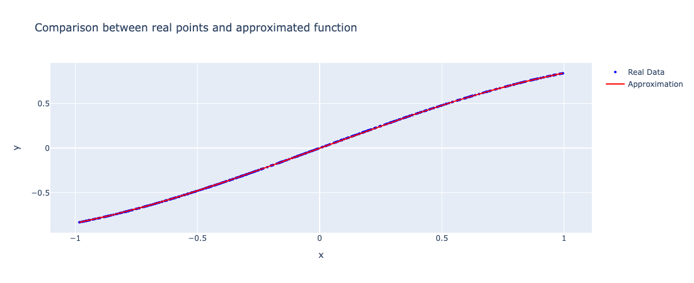
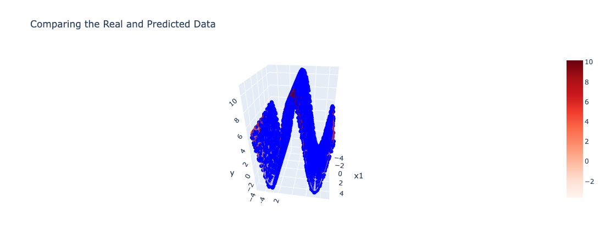
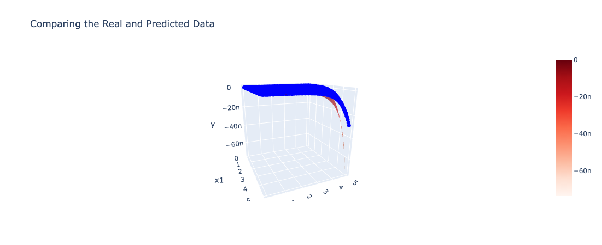
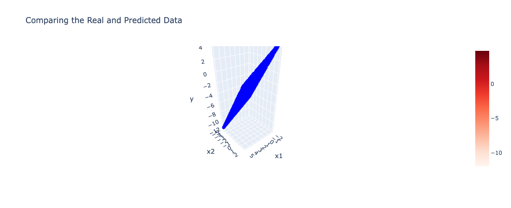
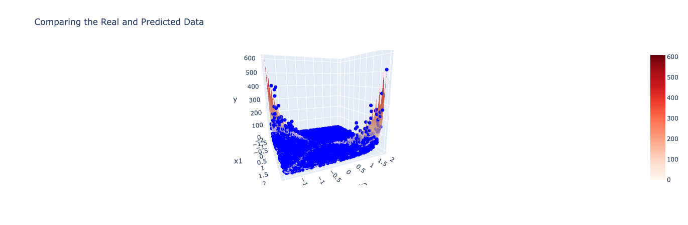

# Symbolic Regression

## Introduction

Symbolic regression aims to find mathematical expressions that best describe a dataset without assuming a predefined model structure. Using genetic programming (GP), it evolves candidate solutions through operations like mutation and crossover, optimizing for accuracy and simplicity. This approach produces interpretable models, making it ideal for scientific discovery and data-driven problem-solving.

## Project Structure

```
CI_2024_Project-work/
├── src/        # Contains main code  
├── data/       # Contains input datasets
├── results/    # Includes plots and results
├── s331156.py  # Symbolic functions found for each input dataset
├── README.md   # Project report
```

## Usage

1. Open `src/SR_code.ypynb` notebook 
2. Locate the parameters cell and update the line: `file_path = "../data/problem_N.npz"`, replacing `N` with the number corresponding to the desiderd dataset to run (from 0 to 8).
3. Run all the cells in the notebook and wait for the execution to complete.

## Contents

To implement symbolic regression, we utilized a variety of genetic programming techniques designed to efficiently explore the space of possible mathematical expressions. These include different methods for **parent selectio**, **crossover**, and **mutation**, each contributing to the optimization process:

* **Parent Selection**
  * Tournament Selection: ensures the survival of fitter individuals while maintaining diversity in the population.
* **Crossover**
  * Crossover Random Height: Nodes are swapped at random heights in the tree.
  * Crossover Similar Height: Nodes are exchanged at comparable heights to preserve structure.
  * Crossover Fixed Height: Nodes are swapped at a predefined height for controlled recombination.
* **Mutation**
  * Mutate all Tree: Replaces the entire tree with a new, random expression.
  * Mutation: Randomly modifies operators, subtrees, or variables to introduce diversity.
  * Mutate Erc: Modifies ephemeral random constants within the tree.
  * Swap Muation: Swaps subtrees to explore alternative structures.

## Observation

We experimented with various parameter configurations and different sets of operators to optimize the symbolic regression process. The goal was to identify the best possible function while minimizing the mean squared error (MSE). These trials allowed us to evaluate how different setups influence the performance and accuracy of the resulting models.

## Experiments

### Operators & Parameters

#### Operators Configuration

| **Function** | **Arity** | **Format String** |
| ------------------ | --------------- | ----------------------- |
| `np.add`         | 2               | `({} + {})`           |
| `np.subtract`    | 2               | `({} - {})`           |
| `np.multiply`    | 2               | `({} * {})`           |
| `np.sin`         | 1               | `sin({})`             |
| `np.cos`         | 1               | `cos({})`             |
| `np.exp`         | 1               | `exp({})`             |
| `np.abs`         | 1               | `abs({})`             |
| `np.arctan`      | 1               | `arctan({})`          |
| `np.cosh`        | 1               | `cosh({})`            |
| `np.sinh`        | 1               | `sinh({})`            |
| `np.tanh`        | 1               | `tanh({})`            |


#### Parameters Configuration 1

| **Parameter**     | **Value** |
| ----------------------- | --------------- |
| `MAX_DEPTH`           | 6               |
| `POP_SIZE`            | 300             |
| `TOURNAMENT_SIZE`     | 5               |
| `CROSSOVER_RATE`      | 0.50            |
| `MAX_GENERATIONS`     | 1500            |
| `ERC_RATE`            | 0.05            |
| `MUTATION_TREE_RATE`  | 0.2             |
| `DYNAMIC_EXPLORATION` | False           |


#### Parameters Configuration 2

| **Parameter**    | **Value** |
| ---------------------- | --------------- |
| `MAX_DEPTH`          | 6               |
| `POP_SIZE`           | 300             |
| `TOURNAMENT_SIZE`    | 3               |
| `CROSSOVER_RATE`     | 0.50            |
| `MAX_GENERATIONS`    | 1500            |
| `ERC_RATE`           | 0.05            |
| `MUTATION_TREE_RATE` | 0.2             |


### Performance and Configuration Summary

The following table shows the Best program and MSE for each dataset. For more details on each dataset, see the corresponding section indicated in the final column.

| Dataset   | MSE (Eval)           | MSE (Global)         | Operators                         | Parameters                               | Crossover                                                | Details                              |
| --------- | -------------------- | -------------------- | --------------------------------- | ---------------------------------------- | -------------------------------------------------------- | ------------------------------------ |
| Dataset 1 | 0.00                 | 0.0                  | [configOp](#operators-configuration) | [configParam1](#parameters-configuration-1) | Dynamic Crossover                                        | [Section Dataset 1](#dataset-1-details) |
| Dataset 2 | 3,905,475,484,756.24 | 4,032,534,585,191.06 | [configOp](#operators-configuration) | [configParam2](#parameters-configuration-2) | Dynamic Crossover                                        | [Section Dataset 2](#dataset-2-details) |
| Dataset 3 | 2.63                 | ~2.82                | [configOp](#operators-configuration) | [configParam2](#parameters-configuration-2) | Dynamic Crossover                                        | [Section Dataset 3](#dataset-3-details) |
| Dataset 4 | ~0.07                | ~0.07                | [configOp](#operators-configuration) | [configParam2](#parameters-configuration-2) | Dynamic Crossover                                        | [Section Dataset 4](#dataset-4-details) |
| Dataset 5 | ~0.00                | ~0.00                | [configOp](#operators-configuration) | [configParam2](#parameters-configuration-2) | Dynamic Crossover                                        | [Section Dataset 5](#dataset-5-details) |
| Dataset 6 | ~0.00                | ~0.00                | [configOp](#operators-configuration) | [configParam2](#parameters-configuration-2) | Dynamic Crossover                                        | [Section Dataset 6](#dataset-6-details) |
| Dataset 7 | 21.5358              | ~32.0467             | [configOp](#operators-configuration) | [configParam1](#parameters-configuration-1) | Exploration (25%, 25%)<br />Crossover Fixed Height (50%) | [Section Dataset 7](#dataset-7-details) |
| Dataset 8 | 31,368.54            | 31,407.42            | [configOp](#operators-configuration) | [configParam1](#parameters-configuration-1) | Crossover Fixed Height                                   | [Section Dataset 8](#dataset-8-details) |

### Dataset Details

---

#### Dataset 1 Details

**Best program**: `sin(x0)`

**MSE**: 0.0000

**Best Program Plot**



---

#### Dataset 2 Details

**Best program**:
`(((((x1 + x0) * (exp(2.27) * (x2 + x0))) - abs((exp(3.80) * exp(2.29)))) * ((cosh(exp(2.29)) + (exp(3.99) * exp(3.99))) + (((x1 + x0) * (x0 + x2)) * (exp(2.42) * exp(3.56))))) * tanh(((tanh(x0) - (arctan(x0) * exp(1.80))) + (tanh(x0) - ((x2 + x1) * tanh(1.67))))))`

**MSE**: 3,905,475,484,756.24

**MSE (all dataset)**: 4,032,534,585,191.06

**Execution print:**

100%|██████████| 1500/1500 [15:10<00:00,  1.65it/s]
Fold 1°  validated with MSE: 3905475484756.2412
Best program of fold 1°: (((((x1 + x0) * (exp(2.27) * (x2 + x0))) - abs((exp(3.80) * exp(2.29)))) * ((cosh(exp(2.29)) + (exp(3.99) * exp(3.99))) + (((x1 + x0) * (x0 + x2)) * (exp(2.42) * exp(3.56))))) * tanh(((tanh(x0) - (arctan(x0) * exp(1.80))) + (tanh(x0) - ((x2 + x1) * tanh(1.67))))))

100%|██████████| 1500/1500 [11:48<00:00,  2.12it/s]
Fold 2°  validated with MSE: 22512754133925.0234
Best program of fold 2°: (exp(exp(exp(tanh((x0 + 1.35))))) * (cosh(sin(sin(sin(sin(sin(cos(x2))))))) - sinh(arctan(arctan(arctan(arctan(arctan((x1 * x2)))))))))

100%|██████████| 1500/1500 [36:26<00:00,  1.46s/it]
Fold 3°  validated with MSE: 12123364995555.5918
Best program of fold 3°: (((((exp(3.70) + exp(4.00)) + exp(4.00)) + (((cosh(x2) * sinh(-3.86)) - (sinh(-3.74) * cosh(4.00))) - (((((cosh(x1) + cosh(x0)) + (cosh(x1) + cosh(x0))) + ((cosh(x1) + cosh(x0)) + (cosh(x1) + cosh(x0)))) + (((cosh(x1) + cosh(x0)) + (cosh(x1) + cosh(x0))) + ((cosh(x1) + cosh(x0)) + (cosh(x1) + cosh(x0))))) - ((exp(3.70) * exp(3.70)) - (sinh(-3.74) * cosh(4.00)))))) + arctan((((cosh(x0) * (exp(x2) + (sinh(x0) * exp(-1.75)))) - (cosh(x2) + cosh(x2))) - ((sinh(x0) + exp(x2)) - exp(3.57))))) * (((cosh(4.00) * exp(3.87)) - (cosh(x0) + (sinh(x2) * sinh(x1)))) * arctan((((tanh(x1) + sinh(x0)) * cosh(1.79)) - (sinh(x0) + (tanh(x1) + sinh(x0)))))))

100%|██████████| 1500/1500 [09:26<00:00,  2.65it/s]
Fold 4°  validated with MSE: 14842837138932.3672
Best program of fold 4°: (arctan((abs(exp(tanh(x1))) + (sinh(x2) + (sinh(x0) * (cosh(-1.14) * cosh(x0)))))) * cosh(exp(exp(cos(exp(2.53))))))

100%|██████████| 1500/1500 [15:09<00:00,  1.65it/s]
Fold 5°  validated with MSE: 28446540092814.1523
Best program of fold 5°: sinh(((((((x1 - x2) + sin(x2)) - (x2 + x2)) + (tanh(x0) * sin(x1))) * sin((tanh(x0) * tanh(x1)))) + cos(((((sin(x1) * tanh(x0)) - (x2 + x2)) * (sin(-0.97) * tanh(x0))) * ((sin(1.11) * (sin(-2.09) * tanh(x0))) * (sin(x2) * sin(2.00)))))))

**Best program found: (((((x1 + x0) * (exp(2.27) * (x2 + x0))) - abs((exp(3.80) * exp(2.29)))) * ((cosh(exp(2.29)) + (exp(3.99) * exp(3.99))) + (((x1 + x0) * (x0 + x2)) * (exp(2.42) * exp(3.56))))) * tanh(((tanh(x0) - (arctan(x0) * exp(1.80))) + (tanh(x0) - ((x2 + x1) * tanh(1.67)))))) MSE: 3'905'475'484'756.2412 and MSE (all dataset): 4032534585191.0591**

#### Dataset 3 Details

**Best program**:
`((((-0.55 - tanh((cosh(x0) - cosh(((-0.95 - cos(x0)) + -0.95))))) + (((cos(((x1 + -1.05) - cos((cosh(cos((cosh(x0) + -1.42))) - (x1 + -1.05))))) - ((x2 + arctan(x2)) + sinh(x1))) + cos((((-0.55 - cos(x0)) - cos(x0)) + -0.95))) + ((1.14 + cos(((x1 + (-0.55 - tanh(tanh(cosh(x0))))) - cos((cosh(-0.95) - x1))))) + ((cos((cosh(-0.95) - (x1 + -0.95))) + (((cos(((((-1.46 - cos(x0)) - cos(x0)) - cosh(-0.55)) - cos(x0))) - x1) + (cos((((((-0.55 - cos(x0)) - cos(x0)) + -0.95) - cosh(-0.55)) - cos(x0))) + ((((cosh(cos(x0)) + ((cos(((((-0.95 - cos(x0)) + -0.95) - cos(x0)) - cos(x0))) - x2) - x1)) + ((((((-0.55 - cos(x0)) - tanh((cosh(x0) - cosh(((-1.05 - cos(x0)) + -1.05))))) + ((cos(((x1 + tanh(x1)) - cosh(-0.95))) - cos(x0)) - tanh((cosh(x0) - cosh(((-0.95 - cos(x0)) + -0.95)))))) + (cos((((-0.55 - tanh((cosh(x0) - cosh(-1.46)))) + -1.46) - -0.95)) - (cos(x0) + cos((cos((tanh(x0) - x0)) + tanh(cosh(x0))))))) - cos(x0)) - cos(x0))) + cos((tanh(x0) - x0))) + cos(((x1 + tanh(x1)) - cosh(-1.05)))))) + ((cos(((x1 + -1.46) - cos((cosh(-0.95) - x1)))) - cos((tanh(cosh(x0)) + tanh(cosh(x0))))) + (cos((cos(x0) - ((cos((tanh(x0) - x0)) - cos(x0)) + -0.55))) - (cos(x0) + -0.95))))) + -0.55)))) * cosh(0.93)) + (cosh(x0) - x1))`

**MSE**: 2.63

**MSE (all dataset)**: ~2.82

**Execution print:**

100%|██████████| 1500/1500 [10:37<00:00,  2.35it/s]
Fold 1°  validated with MSE: 67.8009 e MAE: 5.6253
Best program of fold 1°: ((((((2.05 - ((cos(x0) + (-2.92 + sinh(x1))) + (cos(x0) - (cosh(x0) - (cos(x0) + x2))))) - x2) - x2) - (x2 - ((sin(sinh(x1)) - sinh(x1)) - x1))) - cos(x0)) - cos(x0))

100%|██████████| 1500/1500 [36:37<00:00,  1.47s/it]
Fold 2°  validated with MSE: 2.6322 e MAE: 1.1392
Best program of fold 2°: ((((-0.55 - tanh((cosh(x0) - cosh(((-0.95 - cos(x0)) + -0.95))))) + (((cos(((x1 + -1.05) - cos((cosh(cos((cosh(x0) + -1.42))) - (x1 + -1.05))))) - ((x2 + arctan(x2)) + sinh(x1))) + cos((((-0.55 - cos(x0)) - cos(x0)) + -0.95))) + ((1.14 + cos(((x1 + (-0.55 - tanh(tanh(cosh(x0))))) - cos((cosh(-0.95) - x1))))) + ((cos((cosh(-0.95) - (x1 + -0.95))) + (((cos(((((-1.46 - cos(x0)) - cos(x0)) - cosh(-0.55)) - cos(x0))) - x1) + (cos((((((-0.55 - cos(x0)) - cos(x0)) + -0.95) - cosh(-0.55)) - cos(x0))) + ((((cosh(cos(x0)) + ((cos(((((-0.95 - cos(x0)) + -0.95) - cos(x0)) - cos(x0))) - x2) - x1)) + ((((((-0.55 - cos(x0)) - tanh((cosh(x0) - cosh(((-1.05 - cos(x0)) + -1.05))))) + ((cos(((x1 + tanh(x1)) - cosh(-0.95))) - cos(x0)) - tanh((cosh(x0) - cosh(((-0.95 - cos(x0)) + -0.95)))))) + (cos((((-0.55 - tanh((cosh(x0) - cosh(-1.46)))) + -1.46) - -0.95)) - (cos(x0) + cos((cos((tanh(x0) - x0)) + tanh(cosh(x0))))))) - cos(x0)) - cos(x0))) + cos((tanh(x0) - x0))) + cos(((x1 + tanh(x1)) - cosh(-1.05)))))) + ((cos(((x1 + -1.46) - cos((cosh(-0.95) - x1)))) - cos((tanh(cosh(x0)) + tanh(cosh(x0))))) + (cos((cos(x0) - ((cos((tanh(x0) - x0)) - cos(x0)) + -0.55))) - (cos(x0) + -0.95))))) + -0.55)))) * cosh(0.93)) + (cosh(x0) - x1))

**Best program found: ((((-0.55 - tanh((cosh(x0) - cosh(((-0.95 - cos(x0)) + -0.95))))) + (((cos(((x1 + -1.05) - cos((cosh(cos((cosh(x0) + -1.42))) - (x1 + -1.05))))) - ((x2 + arctan(x2)) + sinh(x1))) + cos((((-0.55 - cos(x0)) - cos(x0)) + -0.95))) + ((1.14 + cos(((x1 + (-0.55 - tanh(tanh(cosh(x0))))) - cos((cosh(-0.95) - x1))))) + ((cos((cosh(-0.95) - (x1 + -0.95))) + (((cos(((((-1.46 - cos(x0)) - cos(x0)) - cosh(-0.55)) - cos(x0))) - x1) + (cos((((((-0.55 - cos(x0)) - cos(x0)) + -0.95) - cosh(-0.55)) - cos(x0))) + ((((cosh(cos(x0)) + ((cos(((((-0.95 - cos(x0)) + -0.95) - cos(x0)) - cos(x0))) - x2) - x1)) + ((((((-0.55 - cos(x0)) - tanh((cosh(x0) - cosh(((-1.05 - cos(x0)) + -1.05))))) + ((cos(((x1 + tanh(x1)) - cosh(-0.95))) - cos(x0)) - tanh((cosh(x0) - cosh(((-0.95 - cos(x0)) + -0.95)))))) + (cos((((-0.55 - tanh((cosh(x0) - cosh(-1.46)))) + -1.46) - -0.95)) - (cos(x0) + cos((cos((tanh(x0) - x0)) + tanh(cosh(x0))))))) - cos(x0)) - cos(x0))) + cos((tanh(x0) - x0))) + cos(((x1 + tanh(x1)) - cosh(-1.05)))))) + ((cos(((x1 + -1.46) - cos((cosh(-0.95) - x1)))) - cos((tanh(cosh(x0)) + tanh(cosh(x0))))) + (cos((cos(x0) - ((cos((tanh(x0) - x0)) - cos(x0)) + -0.55))) - (cos(x0) + -0.95))))) + -0.55)))) * cosh(0.93)) + (cosh(x0) - x1))**

---

#### Dataset 4 Details

**Best program**:
`((3.22 * exp((cos(x1) * (tanh(1.99) * tanh((0.16 + cosh(1.04))))))) + ((tanh((0.27 + cosh(x1))) * ((tanh((2.62 + (3.69 + x0))) * (((tanh(((x1 + exp(1.04)) + 3.56)) * tanh((x1 + cosh(2.55)))) * 1.06) * tanh((0.52 + cosh(x1))))) * exp(cosh(tanh(x1))))) * cos(x1)))`

**MSE**: ~0.0746

**MSE (all dataset)**: ~0.07

**Execution print:**

100%|██████████| 1500/1500 [20:36<00:00,  1.21it/s]
Fold 1°  validated with MSE: 0.1099 e MAE: 0.2705
Best program of fold 1°: (sinh((arctan(exp(cosh(x1))) + (cos(x1) * cosh(arctan(x1))))) + sinh((arctan(sinh(((cos(x1) * cosh(abs(arctan(3.78)))) + arctan(exp((sinh(x0) - sinh(x0))))))) + cos(x1))))


100%|██████████| 1500/1500 [37:03<00:00,  1.48s/it]
Fold 2°  validated with MSE: 0.1156 e MAE: 0.2882
Best program of fold 2°: ((((sinh(cos(abs(x1))) + sinh(cos(x1))) + sinh(abs(tanh(arctan((abs(arctan(x0)) + sinh(cos(x1)))))))) + sinh(cos(x1))) + (sinh((sinh(abs(arctan(2.97))) + arctan(tanh(cos(x1))))) + sinh(sinh(cos(abs(abs(abs(x1))))))))


100%|██████████| 1500/1500 [09:07<00:00,  2.74it/s]
Fold 3°  validated with MSE: 0.1379 e MAE: 0.3041
Best program of fold 3°: ((((sinh((cos(x1) + cos(x1))) + cosh(sin(tanh(sin(x0))))) + sinh((cosh(tanh(x1)) + cos(x1)))) + cos(x1)) + cos(x1))


100%|██████████| 1500/1500 [26:37<00:00,  1.06s/it]
Fold 4°  validated with MSE: 0.2766 e MAE: 0.4299
Best program of fold 4°: (sinh((cos(x1) - (sinh(sinh(sinh(arctan(arctan(arctan(arctan(sinh(sinh(sinh(sinh(sinh(sinh(sinh(arctan(sinh(sinh(sinh(arctan(arctan(sinh(arctan(sinh(sinh(sinh(sinh(sinh(sinh((x0 - x0))))))))))))))))))))))))))))) - sinh(sinh(sin(sinh(cos(x1)))))))) + exp((sin((cos(x1) - (sinh(sinh(arctan(sinh(sinh(sinh(arctan(sinh(arctan(sinh(arctan(arctan(sinh(arctan(sinh(sinh(sinh(sinh(arctan(arctan(sinh(arctan(arctan(sinh(arctan(sinh(sinh(sinh(arctan(sinh(sinh(sinh(sinh(sinh(sinh(sinh(sinh(arctan(sinh(arctan(sinh(sinh((x0 - x0))))))))))))))))))))))))))))))))))))))))))) - sinh(cos(x1))))) - sin(exp(1.44)))))


100%|██████████| 1500/1500 [14:53<00:00,  1.68it/s]
Fold 5°  validated with MSE: 0.0746 e MAE: 0.2312
Best program of fold 5°: ((3.22 * exp((cos(x1) * (tanh(1.99) * tanh((0.16 + cosh(1.04))))))) + ((tanh((0.27 + cosh(x1))) * ((tanh((2.62 + (3.69 + x0))) * (((tanh(((x1 + exp(1.04)) + 3.56)) * tanh((x1 + cosh(2.55)))) * 1.06) * tanh((0.52 + cosh(x1))))) * exp(cosh(tanh(x1))))) * cos(x1)))


**Best program found: ((3.22 * exp((cos(x1) * (tanh(1.99) * tanh((0.16 + cosh(1.04))))))) + ((tanh((0.27 + cosh(x1))) * ((tanh((2.62 + (3.69 + x0))) * (((tanh(((x1 + exp(1.04)) + 3.56)) * tanh((x1 + cosh(2.55)))) * 1.06) * tanh((0.52 + cosh(x1))))) * exp(cosh(tanh(x1))))) * cos(x1))) MSE: 0.0746**

**Best Program Plot**


See the 3D plot here: `./results/plot3d/plot3d_4.html`

---

#### Dataset 5 Details

**Best program**:
`(exp(((((((x0 - cosh(cosh(-2.15))) + abs(arctan(3.87))) + cosh(0.89)) + (x1 + 3.49)) + sin(tanh(x1))) + (tanh(tanh(tanh(x1))) * x1))) * (sin(x0) - (1.94 + abs(x0))))`

**MSE**: ~0.0000

**MSE (all dataset)**: 8.763896529306544e-18

**Execution print:**

100%|██████████| 1500/1500 [57:49<00:00,  2.31s/it]
Fold 1°  validated with MSE: 0.0000 e MAE: 0.0000
Best program of fold 1°: (exp(((((((x0 - cosh(cosh(-2.15))) + abs(arctan(3.87))) + cosh(0.89)) + (x1 + 3.49)) + sin(tanh(x1))) + (tanh(tanh(tanh(x1))) * x1))) * (sin(x0) - (1.94 + abs(x0))))

**Best program of fold 1°: (exp(((((((x0 - cosh(cosh(-2.15))) + abs(arctan(3.87))) + cosh(0.89)) + (x1 + 3.49)) + sin(tanh(x1))) + (tanh(tanh(tanh(x1))) * x1))) * (sin(x0) - (1.94 + abs(x0))))**

**Best Program Plot**


See the 3D plot here: `./results/plot3d/plot3d_5.html`

#### Dataset 6 Details

**Best program**:
`(x0 + (((x0 - (((0.40 * (x0 * tanh(-3.66))) + x1) - x0)) * tanh(-3.28)) + (((((x0 - x0) - x0) - x1) * tanh(-2.44)) - (0.29 * (x0 + x1)))))`

**MSE**: ~0.0000

**MSE (all dataset)**: 6.866974228872815e-05

**Execution print**

100%|██████████| 1500/1500 [21:28<00:00,  1.16it/s]
Fold 1°  validated with MSE: 0.0000 e MAE: 0.0001
Best program of fold 1°: (x0 + (((x0 - (((0.40 * (x0 * tanh(-3.66))) + x1) - x0)) * tanh(-3.28)) + (((((x0 - x0) - x0) - x1) * tanh(-2.44)) - (0.29 * (x0 + x1)))))


100%|██████████| 1500/1500 [36:32<00:00,  1.46s/it]
Fold 2°  validated with MSE: 0.0740 e MAE: 0.2311
Best program of fold 2°: ((x1 + (x1 * arctan(arctan(tanh(((exp(((arctan(tanh(-0.78)) * tanh(0.97)) * (((0.09 + sinh(-1.34)) + x0) + x1))) + tanh((x1 * x1))) + arctan(x1))))))) + (tanh(arctan(x0)) - x0))


100%|██████████| 1500/1500 [1:35:34<00:00,  3.82s/it]
Fold 3°  validated with MSE: 0.1202 e MAE: 0.2856
Best program of fold 3°: (((((tanh((abs(x1) - x1)) + tanh((((((x0 - tanh(tanh((x0 - x0)))) - ((tanh((((x0 + x0) + tanh((tanh(x0) - x0))) - x0)) - x0) - x0)) - x0) - x0) + tanh(((tanh(((x0 + x0) - x0)) + (tanh((((x0 + x0) - (x0 - tanh(x0))) - x0)) + x0)) - (x0 + x0)))))) + (tanh(tanh((tanh((x0 + tanh((((x0 + tanh(x0)) + (tanh(tanh((((cos(((x0 - tanh(x0)) + x0)) - tanh((x0 + (tanh((x0 - (x0 - (x0 + (x0 - x0))))) - x0)))) + x0) - x0))) + x0)) - ((x0 + x0) + x0))))) - (tanh((x0 + 0.78)) + (x0 - x0))))) + (x0 + (x0 + (x0 - x0))))) - (x0 - tanh((x0 + tanh(((tanh(x0) + (tanh(x0) + (x0 + (x0 - x0)))) - ((((x0 - (tanh((((x0 - (tanh(tanh((x0 - x0))) - x0)) - tanh(((x0 + x0) - x0))) - x0)) - x0)) + tanh(((x0 + (x0 - x0)) - (x0 + tanh(tanh((x0 - x0))))))) + tanh((x0 - (x0 + ((x0 - x0) - (tanh(tanh(x0)) - x0)))))) + x0))))))) + (x0 - (((x0 - ((tanh((((x0 - x0) - x0) - x0)) + (x1 - (x0 + x0))) + x0)) + x0) - x1))) + (x0 - (x0 - (x0 - x0))))


100%|██████████| 1500/1500 [32:24<00:00,  1.30s/it]
Fold 4°  validated with MSE: 0.0783 e MAE: 0.2242
Best program of fold 4°: (sin(abs(x0)) + ((x1 * exp(tanh(sin(cos(tanh((x1 - exp(exp(-1.84))))))))) - exp(tanh((x0 - sin(tanh(cos(tanh(exp(x0))))))))))


100%|██████████| 1500/1500 [23:59<00:00,  1.04it/s]
Fold 5°  validated with MSE: 0.1377 e MAE: 0.3094
Best program of fold 5°: ((x1 + arctan((sin(abs(x0)) - exp(x1)))) + (x1 + arctan((cos(arctan(arctan(exp(-0.45)))) - sinh(x0)))))

**Best program found: (x0 + (((x0 - (((0.40 * (x0 * tanh(-3.66))) + x1) - x0)) * tanh(-3.28)) + (((((x0 - x0) - x0) - x1) * tanh(-2.44)) - (0.29 * (x0 + x1))))) MSE: 0.0000**

**Best Program Plot**


See the 3D plot here: `./results/plot3d/plot3d_6.html`

#### Dataset 7 Details

**Best program**:
`exp(sinh((cosh(abs(tanh(x0))) + (abs(tanh(x0)) - abs((x0 - x1))))))`

**MSE**: 21.5358

**MSE (all dataset)**: 32.04679014893223

**Execution print:**

100%|██████████| 1500/1500 [21:39<00:00,  1.15it/s]
Fold 1° validated with MSE: 368.9717
Best program of fold 1°: ((exp((x1 * x0)) + exp((x0 * x1))) + (abs(((x1 * x0) + exp((x0 * x1)))) + exp((x1 * x0))))

100%|██████████| 1500/1500 [18:08<00:00,  1.38it/s]
Fold 2° validated with MSE: 456.8651
Best program of fold 2°: (abs(cosh(abs((arctan(-4.00) - (x1 * x0))))) + abs(abs((exp((x1 * x0)) * (x1 * x0)))))

100%|██████████| 1500/1500 [26:06<00:00,  1.04s/it]
Fold 3° validated with MSE: 367.1223
Best program of fold 3°: (sinh(cosh((sin(x0) + arctan(sin(x1))))) * (abs(cosh((x1 * x0))) - cos((x0 + (x0 + x1)))))

100%|██████████| 1500/1500 [3:37:17<00:00,  8.69s/it]
Fold 4° validated with MSE: 21.5358
Best program of fold 4°: (((cos(((cosh(x1) - cosh(x0)) * cosh(-2.01))) * (cos(((cosh(x1) - cosh(x0)) * cosh(2.15))) * (cos(((cosh(x0) - cosh(x1)) * cosh(-2.01))) * (cos(((cosh(x1) - cosh(x0)) * cosh(2.15))) * (cos(((cosh(x1) - cosh(x0)) * cosh(2.15))) * (sinh((cosh(-1.34) + abs((x1 + x0)))) * cos((sin(cosh(2.15)) * (cosh(x0) - cosh(x1)))))))))) + (cos(((cosh(x1) - cosh(x0)) * sin(sin((cosh(1.06) - cosh(x1)))))) * (cos((cosh(0.87) * (cosh(x0) - cosh(x0)))) * (cos(((cosh(x0) - cosh(x1)) * sin(sin(abs(x1))))) * sinh((abs(x1) + abs(abs(abs(abs((x1 + x0))))))))))) + (cos(((cosh(x0) - cosh(x1)) * cosh(1.94))) * (cos(((cosh(x0) - cosh(x1)) * cosh(2.13))) * (cos(((cosh(x0) - cosh(x1)) * cosh(2.16))) * (cos(((cosh(x0) - cosh(x1)) * cosh(-2.14))) * (cos(((cosh(x0) - cosh(x1)) * sin(cosh(2.23)))) * sinh((cosh(1.31) + abs(abs(abs((x1 + x0))))))))))))

**Best Program Found: (((cos(((cosh(x1) - cosh(x0)) * cosh(-2.01))) * (cos(((cosh(x1) - cosh(x0)) * cosh(2.15))) * (cos(((cosh(x0) - cosh(x1)) * cosh(-2.01))) * (cos(((cosh(x1) - cosh(x0)) * cosh(2.15))) * (cos(((cosh(x1) - cosh(x0)) * cosh(2.15))) * (sinh((cosh(-1.34) + abs((x1 + x0)))) * cos((sin(cosh(2.15)) * (cosh(x0) - cosh(x1)))))))))) + (cos(((cosh(x1) - cosh(x0)) * sin(sin((cosh(1.06) - cosh(x1)))))) * (cos((cosh(0.87) * (cosh(x0) - cosh(x0)))) * (cos(((cosh(x0) - cosh(x1)) * sin(sin(abs(x1))))) * sinh((abs(x1) + abs(abs(abs(abs((x1 + x0))))))))))) + (cos(((cosh(x0) - cosh(x1)) * cosh(1.94))) * (cos(((cosh(x0) - cosh(x1)) * cosh(2.13))) * (cos(((cosh(x0) - cosh(x1)) * cosh(2.16))) * (cos(((cosh(x0) - cosh(x1)) * cosh(-2.14))) * (cos(((cosh(x0) - cosh(x1)) * sin(cosh(2.23)))) * sinh((cosh(1.31) + abs(abs(abs((x1 + x0))))))))))))**

**Best Program Plot**


See the 3D plot here: `./results/plot3d/plot3d_7.html`

---

#### Dataset 8 Details

**Best program**:
`((((tanh((x5 + 2.95)) + ((sinh(x3) + (-3.91 + ((-0.39 + ((((x3 + (((x3 + (x3 + sinh(x3))) + (sinh(x3) + (((sinh(x5) + sinh(x3)) + (abs((sinh(x5) + ((((x5 + tanh(x5)) + tanh((x5 + 2.95))) + x5) + tanh(((((-3.24 + ((-3.91 + (2.95 + -3.91)) + abs((((((x5 + ((x5 + -3.91) + (x5 + -3.91))) + (-3.91 + (2.95 + -3.91))) + abs(sinh(x5))) + -3.91) + ((x5 + -3.91) + (abs(-3.91) + x5)))))) + -3.91) + x5) + -2.52))))) * (((sinh(x5) + x5) + ((-2.52 + abs(((x5 + (-3.91 + (2.95 + -3.91))) + x5))) + (x5 + sinh((-2.52 + cos(((x5 + -3.91) + (x5 + -3.91)))))))) + (sinh(3.82) * x5)))) + ((sinh(x3) + (abs(x5) + (sinh(abs(x4)) * ((-3.91 - abs(abs(abs((-3.91 + -3.91))))) + sinh(-3.91))))) + x3)))) + ((-3.91 + sinh(x5)) - abs(sinh(x5))))) + sinh(x5)) + -3.92) + abs(x5))) + ((abs((((x5 + x5) + (-2.52 + (x5 + ((abs(sinh(x5)) + -3.91) + ((-3.91 + x5) + x5))))) + (x5 + -3.91))) + sinh(3.82)) - (-0.45 + (sinh((x5 + (abs(x5) + -3.91))) + x5)))))) + x3)) + x3) + (0.06 + (x2 + x0))) - x1)`

**MSE**: 31,368.54

**MSE (all dataset)**: 31,407.42

**Execution print:**

100%|██████████| 1500/1500 [17:34<00:00,  1.42it/s]
Fold 1°  validated with MSE: 1553156.0057 e MAE: 767.4500
Best program of fold 1°: ((abs((-4.00 * (-4.00 - 4.00))) * (x3 - -4.00)) - ((x1 * (x2 * x0)) + ((abs(((x5 - 4.00) * (4.00 * (4.00 - ((-4.00 * (4.00 - -4.00)) - (cosh(x4) - -4.00)))))) * arctan(cosh(cosh((tanh(x5) - (3.85 - (tanh(x5) - x5))))))) - ((((x5 - tanh(x5)) * abs(abs(abs(cosh(x5))))) * abs(abs(abs(abs(cosh(x5)))))) + cosh((-3.28 - 3.98))))))

100%|██████████| 1500/1500 [31:51<00:00,  1.27s/it]
Fold 2°  validated with MSE: 401609.5663 e MAE: 419.3977
Best program of fold 2°: (x5 * (abs(((sinh(3.92) - abs(2.53)) * (abs(abs(abs(abs(x4)))) - sinh(x5)))) - (abs((sinh(x5) - (x3 - abs(abs(abs(abs(abs(abs(x4))))))))) + (((abs((sinh(3.92) - abs((sinh(x5) - abs(abs(abs(abs(abs(abs(abs(abs(x4)))))))))))) - sinh(x5)) + abs(abs(abs((((abs((sinh(x5) + ((sinh(x5) - abs(abs(abs(abs(x4))))) - abs(x2)))) - sinh(x5)) - (sinh(x5) - abs(x1))) - sinh(abs(abs(abs(abs(abs(abs(x4)))))))))))) - ((sinh(3.92) * (abs((sinh(x5) - abs(abs(abs(abs(abs(abs(abs(abs(abs(abs(abs(abs(x4)))))))))))))) - x5)) + x0)))))

100%|██████████| 1500/1500 [24:40<00:00,  1.01it/s]
Fold 3°  validated with MSE: 137900.4409 e MAE: 312.7884
Best program of fold 3°: ((cosh((x3 + 1.82)) + (((((x2 + ((((x5 + x5) + (x5 + -3.97)) + x5) * abs((x5 + ((((x5 + (((x5 + (x5 + x5)) + ((x5 + ((((3.68 + x5) + (x5 + ((((x5 + ((1.89 + (x5 + (1.89 + ((((cosh((2.18 + 2.06)) + x3) + ((x5 + x5) * cosh((2.06 + 2.06)))) + 2.06) + 2.06)))) + x5)) + x5) + x5) + cosh((2.06 + 2.06))))) + x5) + x5)) + ((x5 + x5) + x5))) + ((x5 + x5) + x5))) + x5) + x5) + x5))))) + sinh((x5 + x5))) + x0) - x1) - (((x5 + ((((x5 + x5) + cosh(x4)) + x5) + ((((x5 + ((x5 + x5) + x5)) + x5) + (x5 + x5)) + x5))) * ((cosh((2.06 + 2.06)) + 3.21) + 3.21)) + x5))) + cosh((3.03 + 2.34)))

100%|██████████| 1500/1500 [33:36<00:00,  1.34s/it]
Fold 4°  validated with MSE: 526918.7046 e MAE: 516.1751
Best program of fold 4°: (arctan(sinh((((2.66 - cos(1.24)) - cos(x5)) - cos(x5)))) * ((x5 - arctan((tanh(((-0.67 - 2.66) - x4)) - x5))) * (((((((((((((((((((((((((cosh(x5) - cos(x5)) - (x5 - 3.01)) - cos(3.01)) - cos(3.01)) * (((((((((x5 * x5) - cos(x5)) - cos(x5)) - cos((x0 * cos(1.63)))) - -0.67) - cos((x5 - cosh(cos(x4))))) - cos((x5 - cosh(cos((-0.67 - x5)))))) - cos(x5)) - -0.67)) - x5) - x5) - cos((x5 - 1.63))) - x5) - cos((x5 - 1.63))) + -0.67) - x5) - 3.01) - cos(x2)) - x5) - x5) - x5) - x5) - x5) - (x5 - (((x3 * x5) - 3.77) - x5))) - x5) - x5) - x1) - x5) + ((((((x3 * x5) - 3.77) - (x5 - cosh(x5))) - x4) - 3.77) - cos((x5 - 1.63))))))

100%|██████████| 1500/1500 [39:04<00:00,  1.56s/it]
Fold 5°  validated with MSE: 31368.5430 e MAE: 135.3452
Best program of fold 5°: ((((tanh((x5 + 2.95)) + ((sinh(x3) + (-3.91 + ((-0.39 + ((((x3 + (((x3 + (x3 + sinh(x3))) + (sinh(x3) + (((sinh(x5) + sinh(x3)) + (abs((sinh(x5) + ((((x5 + tanh(x5)) + tanh((x5 + 2.95))) + x5) + tanh(((((-3.24 + ((-3.91 + (2.95 + -3.91)) + abs((((((x5 + ((x5 + -3.91) + (x5 + -3.91))) + (-3.91 + (2.95 + -3.91))) + abs(sinh(x5))) + -3.91) + ((x5 + -3.91) + (abs(-3.91) + x5)))))) + -3.91) + x5) + -2.52))))) * (((sinh(x5) + x5) + ((-2.52 + abs(((x5 + (-3.91 + (2.95 + -3.91))) + x5))) + (x5 + sinh((-2.52 + cos(((x5 + -3.91) + (x5 + -3.91)))))))) + (sinh(3.82) * x5)))) + ((sinh(x3) + (abs(x5) + (sinh(abs(x4)) * ((-3.91 - abs(abs(abs((-3.91 + -3.91))))) + sinh(-3.91))))) + x3)))) + ((-3.91 + sinh(x5)) - abs(sinh(x5))))) + sinh(x5)) + -3.92) + abs(x5))) + ((abs((((x5 + x5) + (-2.52 + (x5 + ((abs(sinh(x5)) + -3.91) + ((-3.91 + x5) + x5))))) + (x5 + -3.91))) + sinh(3.82)) - (-0.45 + (sinh((x5 + (abs(x5) + -3.91))) + x5)))))) + x3)) + x3) + (0.06 + (x2 + x0))) - x1)

**Best program found: ((((tanh((x5 + 2.95)) + ((sinh(x3) + (-3.91 + ((-0.39 + ((((x3 + (((x3 + (x3 + sinh(x3))) + (sinh(x3) + (((sinh(x5) + sinh(x3)) + (abs((sinh(x5) + ((((x5 + tanh(x5)) + tanh((x5 + 2.95))) + x5) + tanh(((((-3.24 + ((-3.91 + (2.95 + -3.91)) + abs((((((x5 + ((x5 + -3.91) + (x5 + -3.91))) + (-3.91 + (2.95 + -3.91))) + abs(sinh(x5))) + -3.91) + ((x5 + -3.91) + (abs(-3.91) + x5)))))) + -3.91) + x5) + -2.52))))) * (((sinh(x5) + x5) + ((-2.52 + abs(((x5 + (-3.91 + (2.95 + -3.91))) + x5))) + (x5 + sinh((-2.52 + cos(((x5 + -3.91) + (x5 + -3.91)))))))) + (sinh(3.82) * x5)))) + ((sinh(x3) + (abs(x5) + (sinh(abs(x4)) * ((-3.91 - abs(abs(abs((-3.91 + -3.91))))) + sinh(-3.91))))) + x3)))) + ((-3.91 + sinh(x5)) - abs(sinh(x5))))) + sinh(x5)) + -3.92) + abs(x5))) + ((abs((((x5 + x5) + (-2.52 + (x5 + ((abs(sinh(x5)) + -3.91) + ((-3.91 + x5) + x5))))) + (x5 + -3.91))) + sinh(3.82)) - (-0.45 + (sinh((x5 + (abs(x5) + -3.91))) + x5)))))) + x3)) + x3) + (0.06 + (x2 + x0))) - x1) MSE: 31368.5430 and MSE (all dataset): 31407.4226**

**Samples:** 5000

---

## Collaborations

This project was developed collaboratively with [Gabriele Raffaele](https://github.com/Gabriele-Raffaele) and [Giuseppe Vacante](https://github.com/Peppe2212).

---
